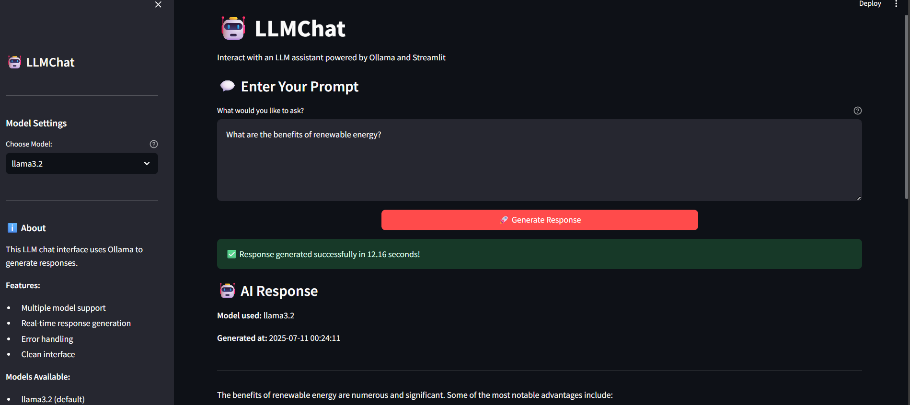

# 🤖 LLMChat

A modern, interactive LLM chat interface built with Streamlit and Ollama that allows users to generate responses using various LLM models.




## ✨ Features

- **Interactive Web Interface**: Clean and intuitive Streamlit-based UI
- **Multiple LLM Models**: Support for various Ollama models (default: llama3.2)
- **Real-time Response Generation**: Instant AI responses to user prompts
- **Error Handling**: Robust error handling with user-friendly messages
- **Responsive Design**: Works seamlessly across different devices
- **Easy Deployment**: Simple setup and deployment process

## 🚀 Quick Start

### Prerequisites

- Python 3.8 or higher
- Ollama installed and running locally
- At least one LLM model downloaded via Ollama

### Installation

1. **Clone the repository**
   ```bash
   git clone https://github.com/anargh-t/LLMChat.git
   cd LLMChat
   ```

2. **Install dependencies**
   ```bash
   pip install -r requirements.txt
   ```

3. **Install and setup Ollama**
   ```bash
   # Download Ollama from https://ollama.ai/
   # Then pull a model (e.g., llama3.2)
   ollama pull llama3.2
   ```

4. **Run the application**
   ```bash
   streamlit run chatbot.py
   ```

5. **Open your browser**
   Navigate to `http://localhost:8501` to access the chatbot.

## 📋 Requirements

Create a `requirements.txt` file with the following dependencies:

```
streamlit>=1.28.0
ollama>=0.1.0
```

## 🎯 Usage

1. **Start the Application**: Run `streamlit run chatbot.py`
2. **Enter Your Prompt**: Type your question or prompt in the text area
3. **Generate Response**: Click the "Generate Response" button
4. **View Results**: The AI-generated response will appear below

### Example Prompts

- "Explain quantum computing in simple terms"
- "Write a short story about a robot learning to paint"
- "What are the benefits of renewable energy?"
- "Create a recipe for chocolate chip cookies"

## 🔧 Configuration

### Changing the Model

You can modify the default model in `chatbot.py`:

```python
def generate_llm_response(prompt, model="llama3.2"):  # Change model here
```

Available models include:
- `llama3.2` (default)
- `llama3.1`
- `mistral`
- `codellama`
- `neural-chat`

### Customizing the Interface

The Streamlit interface can be customized by modifying:
- Title and descriptions
- Text area sizes
- Button styling
- Response formatting

## 🛠️ Development

### Project Structure

```
llmchat/
├── chatbot.py          # Main application file
├── requirements.txt    # Python dependencies
├── README.md          # Project documentation
├── .gitignore         # Git ignore file
└── examples/          # Example prompts and responses
    └── sample_prompts.txt
```

## 📝 License

This project is licensed under the MIT License - see the [LICENSE](LICENSE) file for details. 