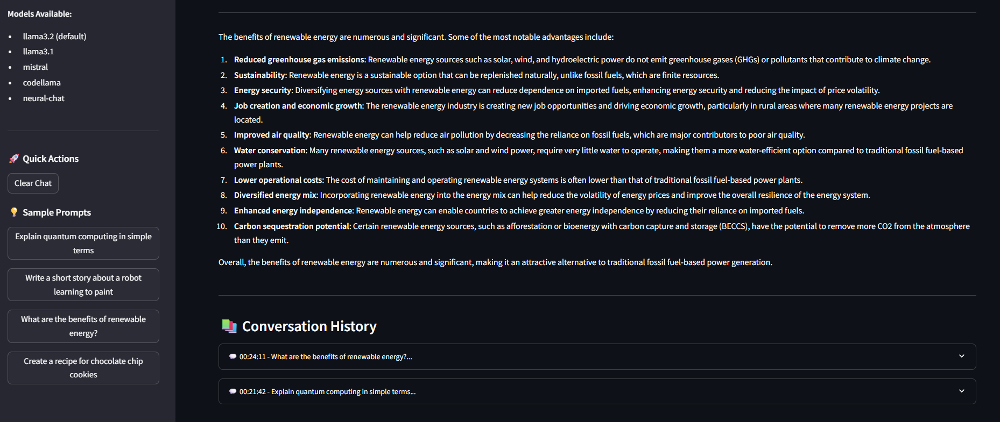

# 🤖 LLMChat

A modern, interactive LLM chat interface built with Streamlit and Ollama that allows users to generate responses using various LLM models.




## ✨ Features

- **Interactive Web Interface**: Clean and intuitive Streamlit-based UI
- **Multiple LLM Models**: Support for various Ollama models (default: llama3.2)
- **Real-time Response Generation**: Instant AI responses to user prompts
- **Error Handling**: Robust error handling with user-friendly messages
- **Responsive Design**: Works seamlessly across different devices
- **Easy Deployment**: Simple setup and deployment process
- **Cloud Ready**: Configured for Streamlit Cloud deployment

## 🚀 Quick Start

### Local Development

#### Prerequisites

- Python 3.8 or higher
- Ollama installed and running locally
- At least one LLM model downloaded via Ollama

#### Installation

1. **Clone the repository**
   ```bash
   git clone https://github.com/anargh-t/LLMChat.git
   cd LLMChat
   ```

2. **Install dependencies**
   ```bash
   pip install -r requirements.txt
   ```

3. **Install and setup Ollama**
   ```bash
   # Download Ollama from https://ollama.ai/
   # Then pull a model (e.g., llama3.2)
   ollama pull llama3.2
   ```

4. **Run the application**
   ```bash
   streamlit run chatbot.py
   ```

5. **Open your browser**
   Navigate to `http://localhost:8501` to access the chatbot.

### 🌐 Streamlit Cloud Deployment

#### Option 1: Deploy to Streamlit Cloud (Recommended)

1. **Push your code to GitHub**
   ```bash
   git add .
   git commit -m "Add Streamlit Cloud deployment configuration"
   git push origin main
   ```

2. **Deploy on Streamlit Cloud**
   - Go to [share.streamlit.io](https://share.streamlit.io)
   - Sign in with your GitHub account
   - Click "New app"
   - Select your repository and set the path to `chatbot.py`
   - Click "Deploy"

#### Option 2: Manual Deployment

1. **Ensure your repository is public**
2. **Verify deployment files are present**:
   - `chatbot.py` (main app file)
   - `requirements.txt` (Python dependencies)
   - `.streamlit/config.toml` (Streamlit configuration)
   - `packages.txt` (system dependencies, if needed)

3. **Deploy via Streamlit Cloud dashboard**

## 📋 Requirements

The `requirements.txt` file includes:

```
streamlit>=1.28.0
ollama>=0.1.0
requests>=2.31.0
```

## 🎯 Usage

1. **Start the Application**: Run `streamlit run chatbot.py`
2. **Enter Your Prompt**: Type your question or prompt in the text area
3. **Generate Response**: Click the "Generate Response" button
4. **View Results**: The AI-generated response will appear below

### Example Prompts

- "Explain quantum computing in simple terms"
- "Write a short story about a robot learning to paint"
- "What are the benefits of renewable energy?"
- "Create a recipe for chocolate chip cookies"

## 🔧 Configuration

### Changing the Model

You can modify the default model in `chatbot.py`:

```python
def generate_llm_response(prompt, model="llama3.2"):  # Change model here
```

Available models include:
- `llama3.2` (default)
- `llama3.1`
- `mistral`
- `codellama`
- `neural-chat`

### Customizing the Interface

The Streamlit interface can be customized by modifying:
- Title and descriptions
- Text area sizes
- Button styling
- Response formatting

## 🛠️ Development

### Project Structure

```
llmchat/
├── chatbot.py              # Main application file
├── requirements.txt        # Python dependencies
├── packages.txt           # System dependencies (for Streamlit Cloud)
├── .streamlit/
│   └── config.toml       # Streamlit configuration
├── README.md              # Project documentation
├── .gitignore             # Git ignore file
└── examples/              # Example prompts and responses
    └── sample_prompts.txt
```

### Deployment Files

- **`.streamlit/config.toml`**: Streamlit configuration for deployment
- **`packages.txt`**: System dependencies (if needed)
- **`requirements.txt`**: Python package dependencies

## 🚨 Important Notes

### For Streamlit Cloud Deployment

⚠️ **Note**: Streamlit Cloud doesn't support running Ollama locally. For a fully functional cloud deployment, you would need to:

1. **Use a cloud-based Ollama service** (like Ollama Cloud)
2. **Modify the code** to connect to a remote Ollama instance
3. **Or use alternative LLM APIs** (like OpenAI, Anthropic, etc.)

The current implementation is designed for local development with Ollama running on your machine.

## 📝 License

This project is licensed under the MIT License - see the [LICENSE](LICENSE) file for details. 